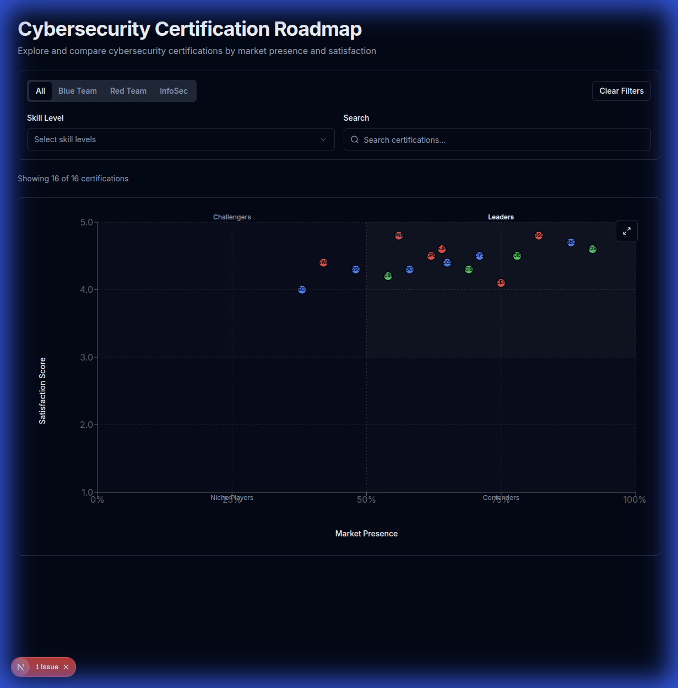

# Cybersecurity Certification Roadmap

Interactive visualization of cybersecurity certifications based on market presence and community satisfaction.



## 🚀 Quick Start

```bash
npm install
npm run dev
```

Visit [http://localhost:3000](http://localhost:3000)

## ✨ Features

- **Interactive Scatter Plot**: Visualize certifications by market presence (X) and satisfaction (Y)
- **Color-Coded Types**: Blue Team (blue), Red Team (red), InfoSec (green)
- **Smart Filtering**: Filter by type, skill level, or search by name
- **Detail Modal**: Click any certification for complete information
- **Full-Screen Mode**: Expand chart for better viewing
- **Responsive Design**: Works on desktop, tablet, and mobile

## 🏗️ Architecture

```
src/
├── app/                    # Next.js App Router
│   └── page.tsx           # Main page with filters + chart
├── components/            
│   ├── CertificationChart.tsx        # Scatter plot visualization
│   ├── CertificationFilters.tsx      # Filter controls
│   ├── CertificationDetailModal.tsx  # Detail view
│   ├── CustomCertNode.tsx            # Color-coded chart nodes
│   └── ui/                           # shadcn/ui components
├── hooks/                 
│   ├── useChartFilters.ts # Filter state + logic
│   └── useDebounce.ts     # Search debouncing (300ms)
├── types/                 
│   └── certification.ts   # TypeScript + Zod schemas
└── data/                  
    └── mock-certifications.ts # 16 sample certifications
```

### Key Design Decisions

**Zod Validation**: Runtime type safety for all data  
**Custom Hook**: `useChartFilters` separates logic from UI  
**Debounced Search**: 300ms delay reduces unnecessary re-renders  
**Native Fullscreen API**: Better UX than CSS-only solution  
**ResponsiveContainer Wrapper**: Recharts requires simple height values

## 📊 Data Structure

Each certification includes:
- Basic info (title, abbreviation, description, cost)
- Metrics (market_presence: 0-1, satisfaction: 1-5, quality: 1-5)
- Classification (cert_type, skill_level)
- Details (provider, requirements, exam format, domains)

See `types/certification.ts` for complete schema.

## 🧪 Testing

```bash
npm test        # Run all 90 tests
npm run build   # Production build
npm audit       # Security check (0 vulnerabilities)
```

**Test Coverage:**
- 90 tests across 7 suites
- Component rendering
- Filter logic
- Data validation
- Integration tests

## 🔒 Security

- Next.js ≥16.0.10 (CVE-2025-55182, CVE-2025-55184, CVE-2025-67779)
- React ≥19.0.3
- Automated version checks in CI/CD
- Zero npm vulnerabilities

## 🎯 Assumptions

1. **Mock Data**: Using 16 sample certifications (production would connect to API)
2. **Market Presence**: Normalized 0-1 value representing popularity
3. **Satisfaction**: Average rating from community votes (1-5 scale)
4. **Quadrant Split**: 50% market presence, 3.0 satisfaction

## ⚠️ Known Limitations

1. **Static Data**: No live API connection
2. **Basic Animations**: Hover effects only (no complex transitions)
3. **English Only**: No internationalization
4. **Desktop Optimized**: Mobile works but desktop experience is better

## 🛠️ Tech Stack

- **Framework**: Next.js 16.1.4 (App Router)
- **Language**: TypeScript
- **UI**: shadcn/ui (Radix + Tailwind)
- **Charts**: Recharts
- **Validation**: Zod
- **Testing**: Jest + React Testing Library
- **CI/CD**: GitHub Actions

## 📝 Development

```bash
npm run dev     # Development server
npm run build   # Production build
npm run lint    # ESLint
npm test        # Jest tests
```

## 🚀 Deployment

**Vercel (Recommended):**
1. Push to GitHub
2. Import repo in Vercel
3. Auto-deploys on push

**Build Output:**
- Static pages: 3 routes
- Build time: ~2 seconds
- Zero errors/warnings

## 📄 License

GNU General Public License v3.0
